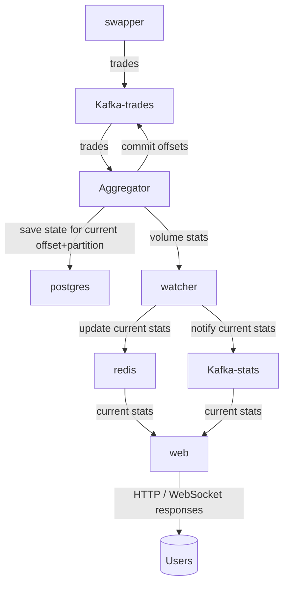

# Volumer

**Volumer** is a real-time service for calculating trading volume statistics over different time intervals (5m, 1h, 24h, ...) 
with rolling sums alg.

## What for

This project is a test assignment:

**Context**<br>
You have 1000 swaps per second coming from a producer (who, token, amount, usd, side,..). Producer also persists this data in db . Need to build a system that calculates real-time token statistics (5min volume, 1H volume, .. , 24h volume, transaction counts, etc) and serves this data via HTTP API and WebSocket updates with minimal latency. System must be highly available and handle restarts without losing data or missing events during startup time. It should be scalable, so we can spin more instances. Swaps data may contain duplicates and block order is not guaranteed.

**Theoretical**<br>
Design the complete architecture. What transport mechanisms would you use from producer? Where would you store different types of data? How would you ensure high availability and zero data loss?

**Practical**<br>
Implement the Go service that reads swap events from a channel, calculates statistics, serves the data over HTTP,  submits updates to a WebSocket channel and handles restarts. Use interfaces for storage. (edited)

## Volumer parts(this proj)

Volumer consists of the following services:

- **faketrader** — generates trades and publishes them to Kafka.
- **consumer** — reads trades from Kafka and commits offsets when state is saved.
- **aggregator** — aggregates trading volume over specified time intervals, saves state and notify consumer for commit.
- **watcher** — polls `aggregator.Stats` and updates data for `web`.
- **web** — serves trading statistics via WebSockets and HTTP.
- **interrupter** — listens for syscalls.

## Full system design (Mermaid)


### Data flow
- topic `trades` has multiple partitions 
- trades/swaps fall into the kafka topic `trades` with `partition key = currency`. So trades within partition are time ordered
- each aggregate instance consumes some partitions and aggregate tickers(10m, 1h...)
- postgres has a table (partition, offset, state) with the unique key (partition, offset)
- aggregate instance periodically stores own state to postgres with upsert stmt(partition, offset, state)
- aggregate instance commits stored part+offset to `trades` kafka topic
- the aggregated statistics are pushed to redis, kafka `stats` topic, compacted by currency key
- web service consumes `stats` topic and push statistics to users with websocket
- web service serves statistics from redis with http

### Restore aggregate service
- aggregator connects to kafka-trades with a consumer group
- it gets assigned partitions with consumer callback `Setup(session sarama.ConsumerGroupSession)`
- restore state for assigned partitions from postgres
- skip trades from the topic with earlier offset than the restored (if app successfully stored state to PG, but cannot commit offset to kafka)
- continue normal flow


## Run
server:
```
make kafka
make run
```
clients:
```
make http
make wsclient
```
