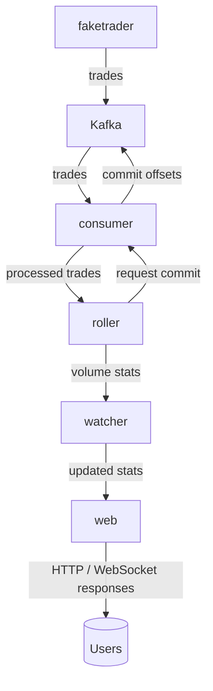
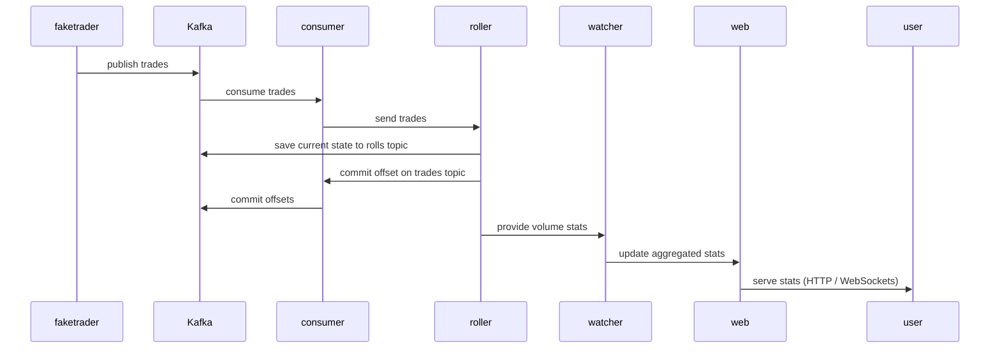

# Volumer

**Volumer** is a real-time service for calculating trading volume statistics over different time intervals (5m, 1h, 24h, ...).

## What for

This project is a test assignment:

**Context**<br>
You have 1000 swaps per second coming from a producer (who, token, amount, usd, side,..). Producer also persists this data in db . Need to build a system that calculates real-time token statistics (5min volume, 1H volume, .. , 24h volume, transaction counts, etc) and serves this data via HTTP API and WebSocket updates with minimal latency. System must be highly available and handle restarts without losing data or missing events during startup time. It should be scalable, so we can spin more instances. Swaps data may contain duplicates and block order is not guaranteed.

**Theoretical**<br>
Design the complete architecture. What transport mechanisms would you use from producer? Where would you store different types of data? How would you ensure high availability and zero data loss?

**Practical**<br>
Implement the Go service that reads swap events from a channel, calculates statistics, serves the data over HTTP,  submits updates to a WebSocket channel and handles restarts. Use interfaces for storage. (edited)

## Architecture

Volumer consists of the following services:

- **faketrader** — generates trades and publishes them to Kafka.
- **consumer** — reads trades from Kafka and commits offsets when state is saved.
- **roller** — aggregates trading volume over specified time intervals.
- **watcher** — polls `roller` and updates data for `web`.
- **interrupter** — listens for system calls (syscalls).
- **web** — serves trading statistics via WebSockets and HTTP.

## Data Flow (Mermaid)





## Run
server:
```
make kafka
make run
```
client:
```
make http
make wsclient
```

## Known issues
- sarama SyncProducer is too slow, use AsyncProducer instead
- potential bottleneck with one topic partition
