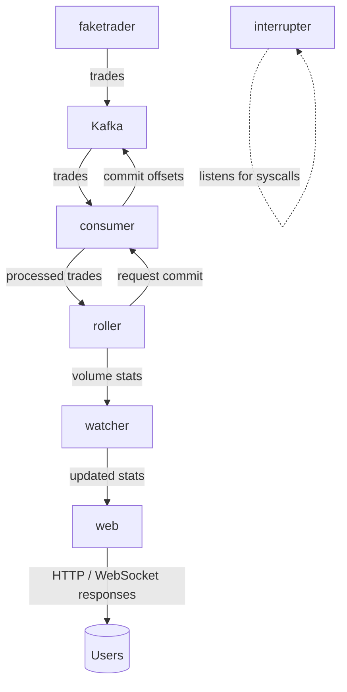
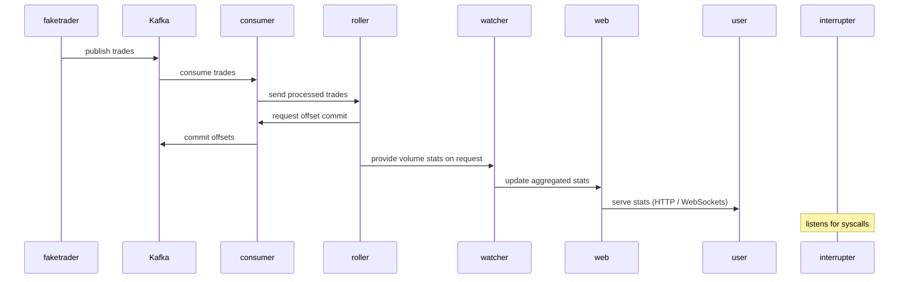

# Volumer

**Volumer** is a real-time service for calculating trading volume statistics over different time intervals (5m, 1h, 24h, ...).

## Architecture

Volumer consists of the following services:

- **faketrader** — generates trades and publishes them to Kafka.
- **consumer** — reads trades from Kafka and commits offsets when state is saved.
- **roller** — aggregates trading volume over specified time intervals.
- **watcher** — polls `roller` and updates data for `web`.
- **interrupter** — listens for system calls (syscalls).
- **web** — serves trading statistics via WebSockets and HTTP.

## Data Flow (Mermaid)

